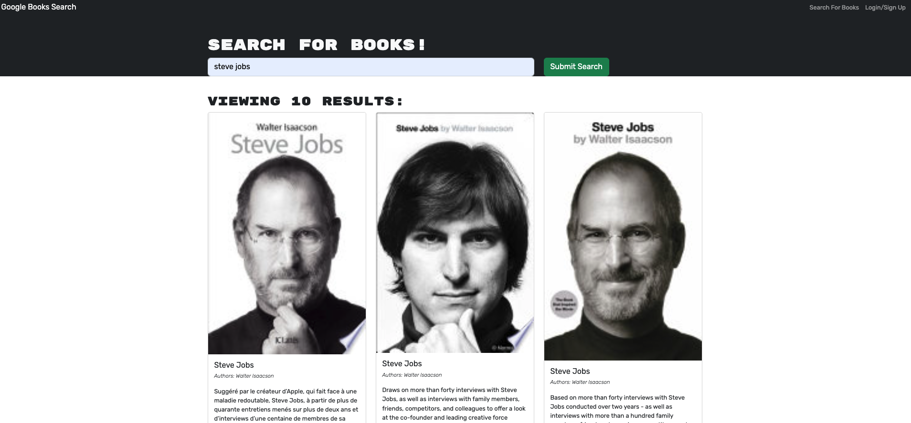

# Book Search Engine Starter Code

This project uses the following technologies:

- MERN Stack (MongoDB, Express.js, React, Node.js)
- GraphQL
- Apollo Server
- JavaScript
- HTML/CSS
- Bootstrap
- JWT
- Heroku

## Description

This project aims to refactor an existing Google Books search engine built with a RESTful API into a GraphQL API using Apollo Server. The application utilizes the MERN stack with a React front end, MongoDB database, and Node.js/Express.js server and API, and it allows users to save book searches to a MongoDB database.

This project's primary challenge is to set up an Apollo Server for handling GraphQL queries and mutations, modify the existing authentication middleware for a GraphQL API context, create an Apollo Provider for requests, and finally, deploy the application to Heroku.
here is the link to the deployed application on Heroku: [Click Here]()

## Table of Contents

- [Installation](#installation)
- [Usage](#usage)
- [Credits](#credits)
- [Tests](#tests)

## Installation

To install the project follow the steps below:

1.  Clone the repository to your local machine
    bash
    ` git clone https://github.com/etapm/M21_MERN.git`
2.  Install all necessary packages
    `npm install`

3.  If not done already, install Apollo Server (Version 2.15.0 is used in this project)
    `npm install apollo-server-express@2.15.0`

4.  Start the application
    ` npm start`

5.  Your application should now be running on localhost:3000 (or another port if specified)

Review the code on the GitHub repository by visiting the [GitHub Repository](https://github.com/etapm/M19_TextEditor).

## Usage

1.  Open the app in your browser.

    

2.  On the main screen, you'll see options to "Search for Books" and "Login/Signup".

3.  To find a new book, click on "Search for Books".

4.  Enter the author, genre, or title in the search field and press submit.

5.  You'll see a list of books matching your search with details and a link to Google Books.

6.  To save books for later, click "Login/Signup" and either log in or sign up.
    
7.  Once logged in, you can save books from your search results.
    
8.  To see your saved books, select the "My Saved Books" option.
    
9.  You can also remove books from your saved list anytime.
    

## Credits

N/A

## License

N/A

## Badges

N/A

## Features

N/A

## How to Contribute

N/A

## Tests

N?A
